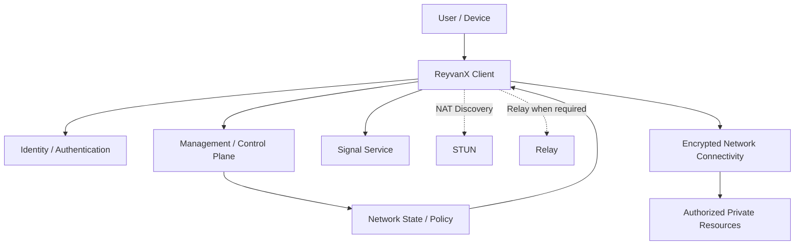
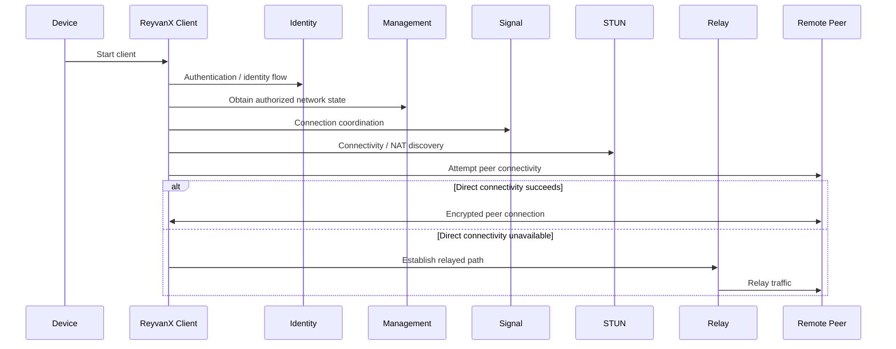
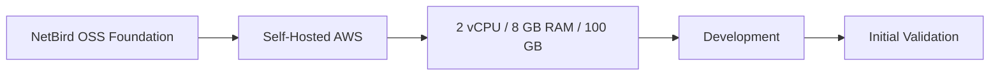
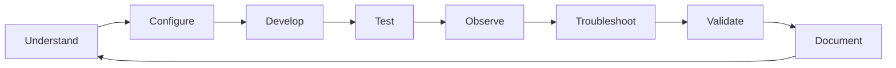
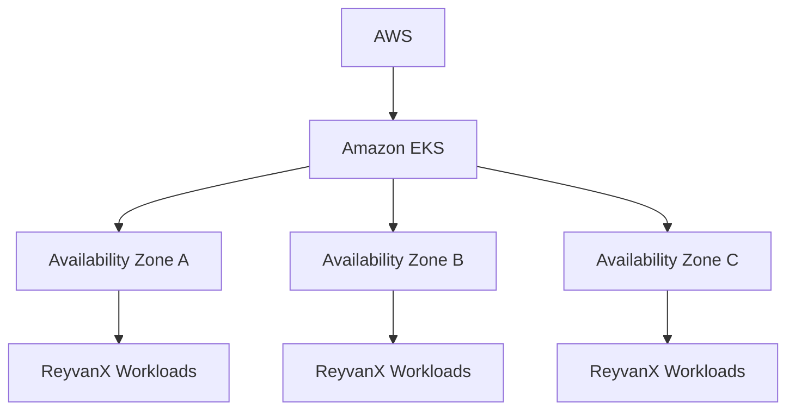
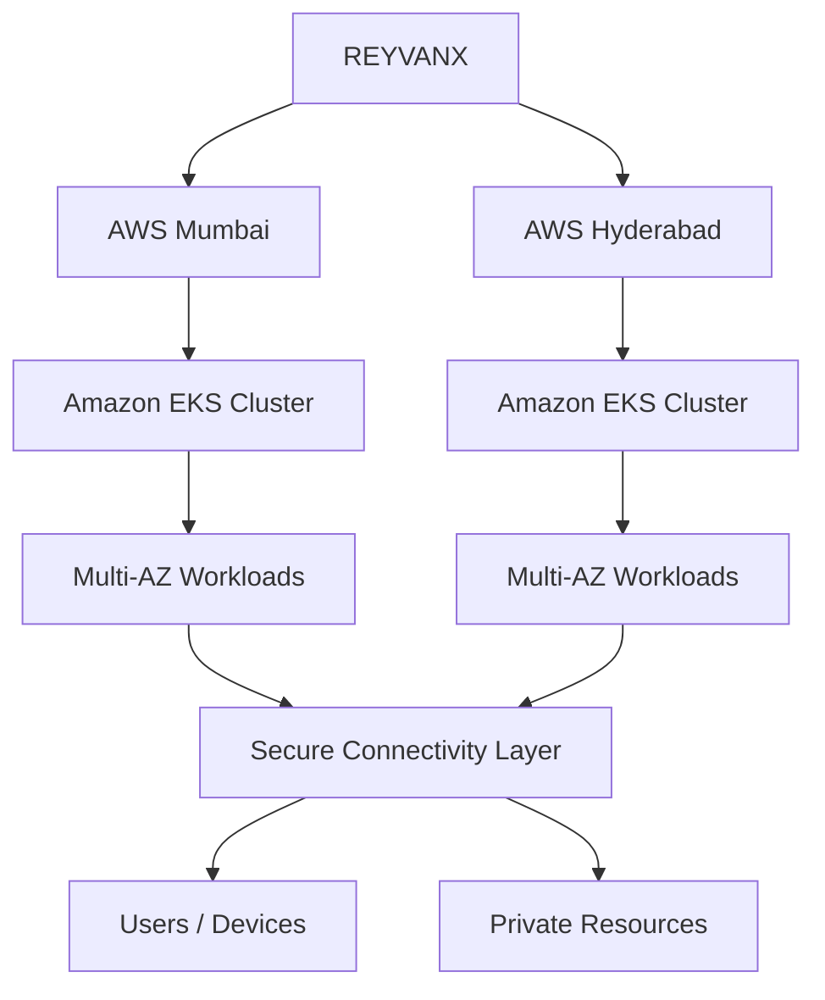
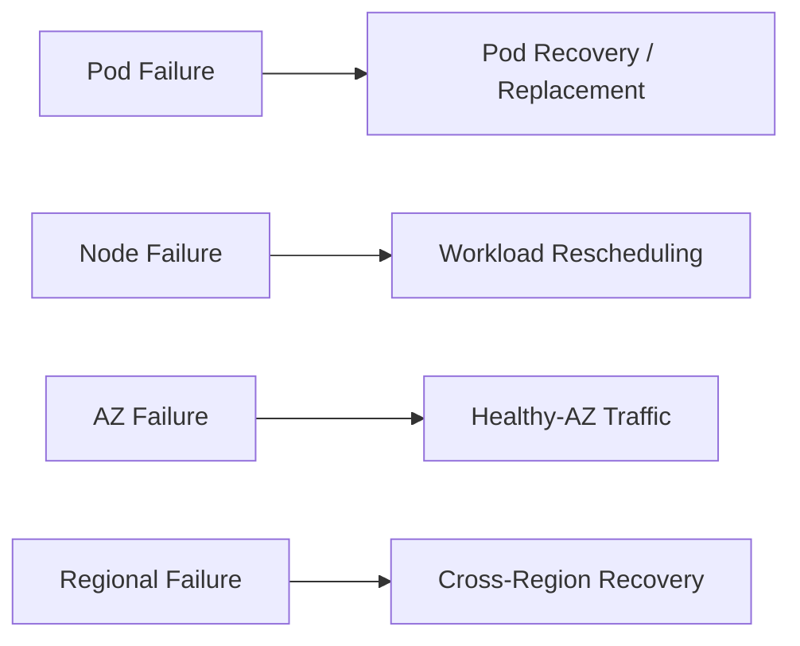
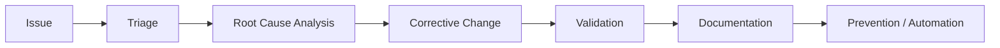
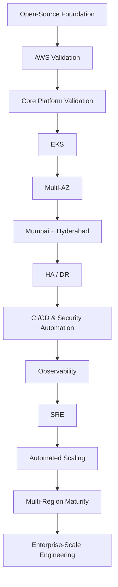

# ReyvanX

**ReyvanX** is a self-hosted secure networking platform currently under development and validation on AWS.

The project is built on the **NetBird open-source foundation** and is being progressively evaluated, configured, developed, tested, and adapted as the technical foundation for ReyvanX.

> **Project status:** Development / Initial Validation  
> **Deployment model:** Self-hosted on AWS  
> **Production readiness:** Not yet production-ready  
> **Future direction:** Amazon EKS, Multi-AZ, Mumbai + Hyderabad multi-region architecture, high availability, disaster recovery, CI/CD, observability, SRE, security validation, and automated scaling

---

## Table of Contents

- [What is ReyvanX?](#what-is-reyvanx)
- [Current Status](#current-status)
- [Current AWS Environment](#current-aws-environment)
- [Current Capabilities](#current-capabilities)
- [Architecture](#architecture)
- [Repository Structure](#repository-structure)
- [Major Component Interaction](#major-component-interaction)
- [Current Deployment Model](#current-deployment-model)
- [Development Workflow](#development-workflow)
- [Testing Strategy](#testing-strategy)
- [Security Considerations](#security-considerations)
- [Engineering Progression](#engineering-progression)
- [Production Roadmap](#production-roadmap)
- [Amazon EKS Roadmap](#amazon-eks-roadmap)
- [Mumbai + Hyderabad Multi-Region Roadmap](#mumbai--hyderabad-multi-region-roadmap)
- [High Availability and Disaster Recovery](#high-availability-and-disaster-recovery)
- [CI/CD and SDLC Roadmap](#cicd-and-sdlc-roadmap)
- [Pre-Test and Post-Test Methodology](#pre-test-and-post-test-methodology)
- [Observability and SRE Roadmap](#observability-and-sre-roadmap)
- [Long-Term Engineering Vision](#long-term-engineering-vision)
- [Project Status](#project-status)
- [Open-Source Acknowledgements](#open-source-acknowledgements)
- [Licensing](#licensing)

---

## What is ReyvanX?

ReyvanX is a secure networking project intended to provide controlled connectivity between authorized users, devices, services, applications, and private infrastructure.

The current codebase is based on the NetBird open-source networking foundation and contains the core components required to establish, coordinate, manage, and support encrypted peer networking.

ReyvanX is **not presented as the original NetBird product**. NetBird is the upstream open-source foundation from which significant portions of the current codebase originate.

The ReyvanX team is currently focused on understanding and validating that foundation, configuring the platform for the ReyvanX environment, troubleshooting the system, and progressively developing the project toward its intended architecture.

---

## Current Status

ReyvanX is currently in the **development and initial validation phase**.

The present focus includes:

- understanding the existing networking architecture;
- validating core platform components;
- validating client behavior;
- management/control-plane analysis;
- signal service validation;
- relay behavior;
- STUN and NAT traversal behavior;
- network routing;
- DNS behavior;
- identity and authentication flows;
- encryption and secure connectivity;
- access-control behavior;
- connectivity testing;
- integration testing;
- troubleshooting;
- infrastructure validation; and
- identifying the changes required for future production operation.

The current environment should therefore be treated as an **engineering and validation environment**, not as evidence of production readiness, enterprise scale, a service-level commitment, or a highly available deployment.

---

## Current AWS Environment

The current ReyvanX environment is self-hosted on AWS with the following baseline resources:

| Resource | Current Configuration |
|---|---:|
| Deployment | Self-hosted AWS |
| CPU | 2 vCPUs |
| Memory | 8 GB RAM |
| Disk | 100 GB |
| Phase | Development / Initial Validation |
| Team model | Collaborative development |
| EKS | **Not currently the production architecture** |
| Multi-AZ | **Planned** |
| Multi-region | **Planned** |
| Production HA/DR | **Planned** |

These resources describe the **current validation environment only**. They are not sizing recommendations, capacity limits, scalability claims, or production requirements.

---

## Current Capabilities

The following capabilities are represented by components present in the current repository.

They describe the functionality of the codebase and its upstream-derived networking foundation. They do **not** imply that every capability has completed ReyvanX production validation.

### Secure peer networking

The repository contains client and networking components for establishing secure connectivity between participating peers.

The platform architecture is designed around encrypted peer communication rather than exposing private resources directly to the public network.

### Client

The `client/` tree contains the endpoint-side networking implementation used to participate in the secure network.

Current engineering work includes validating:

- client initialization and lifecycle;
- peer connectivity;
- network configuration;
- routing behavior;
- DNS integration;
- connection establishment;
- reconnect/recovery behavior; and
- interaction with control-plane services.

### Management

The `management/` component provides the management/control-plane portion of the networking platform.

It is responsible for coordinating network state and policy-related information required by participating clients.

ReyvanX is currently validating and understanding this component rather than claiming a separately developed ReyvanX management platform.

### Signal

The `signal/` component provides signaling functionality used during peer connection establishment and coordination.

Signaling supports the process through which peers obtain the information needed to establish connectivity.

### Relay

The `relay/` component provides relay functionality for situations where direct peer connectivity cannot be established or where relayed connectivity is otherwise required by the underlying networking system.

Direct peer connectivity and relayed connectivity should be validated independently during ReyvanX testing.

### STUN / NAT traversal support

The repository contains a dedicated `stun/` component as part of the networking stack.

STUN-related functionality participates in connectivity discovery and NAT traversal workflows used during peer connection establishment.

### DNS

The `dns/` package contains DNS-related networking functionality used by the client/platform architecture.

DNS behavior remains an active ReyvanX validation area, particularly around network configuration, name resolution, routing interactions, and failure behavior.

### Identity integration

The repository includes an `idp/` component and management-side identity/authentication functionality inherited from the upstream foundation.

Identity and authentication behavior is currently being evaluated as part of ReyvanX development.

This README intentionally does **not** claim support for any specific identity provider unless that provider and its configuration are explicitly validated for the ReyvanX deployment.

### Encryption

The repository contains dedicated encryption functionality in `encryption/` together with the secure networking implementation used by the client stack.

Encryption and key-handling behavior are considered security-critical and remain part of the ongoing validation effort.

### Routing and network resources

The repository includes routing and network-oriented packages such as:

- `route/`;
- `proxy/`;
- `agent-network/`;
- `flow/`; and
- related shared networking components.

These form part of the networking and connectivity implementation.

### Access-control foundation

Management and networking components contain the upstream mechanisms used to coordinate authorized connectivity and policy.

ReyvanX is currently validating these mechanisms as part of its access-control and security work.

### Testing infrastructure

The repository contains:

- unit tests distributed throughout the Go packages;
- `integration_tests/`;
- `e2e/`;
- management network-map integration testing;
- build/test tooling; and
- supporting development automation.

The existence of these tests does not by itself constitute production certification or complete ReyvanX production validation.

---

## Architecture

At a conceptual level, the current platform separates endpoint networking from control and connectivity-assistance services.



The exact path used for a connection depends on network conditions, configuration, policy, and the behavior of the underlying networking stack.

---

## Repository Structure

The repository is a multi-component Go codebase containing networking, control-plane, infrastructure, testing, and supporting packages.

```text
ReyvanX/
├── .devcontainer/
├── .githooks/
├── .github/
├── LICENSES/
│
├── agent-network/
├── base62/
├── client/
├── combined/
├── dns/
├── encryption/
├── flow/
├── formatter/
├── idp/
├── management/
├── monotime/
├── proxy/
├── relay/
├── route/
├── shared/
├── sharedsock/
├── signal/
├── stun/
├── trustedproxy/
├── upload-server/
├── util/
├── version/
│
├── e2e/
├── integration_tests/
│   └── management/
│       └── network_map_db/
│
├── infrastructure_files/
├── release_files/
├── magefiles/
├── tools/
│
├── go.mod
├── go.sum
├── Makefile
├── LICENSE
└── README.md
```

Some directories are supporting/internal packages rather than independently deployed services.

The primary platform areas currently under ReyvanX engineering focus are the client, management, signal, relay, STUN, DNS, identity, encryption, routing, networking, testing, and deployment layers.

---

## Major Component Interaction

A simplified connection lifecycle is:



This is a high-level representation. It intentionally avoids documenting protocol-level guarantees that have not yet been separately validated for ReyvanX.

---

## Current Deployment Model

The present progression is:



The current deployment exists primarily to allow the team to:

- understand platform behavior;
- validate service interaction;
- investigate networking behavior;
- test configuration;
- reproduce failures;
- troubleshoot connectivity;
- evaluate security boundaries; and
- prepare the architecture for later stages.

It must not be interpreted as the final production architecture.

---

## Development Workflow

During the current phase, development should prioritize reproducibility and understanding before large-scale architectural changes.

A typical engineering cycle is:



Changes should be:

1. scoped to a defined problem;
2. reviewed for upstream implications;
3. tested at the smallest applicable level;
4. validated in an integration environment where necessary;
5. checked for networking/security regressions; and
6. documented when behavior or architecture changes.

Source code should not be modified solely to make documentation claims true.

---

## Testing Strategy

### Current testing

The repository already contains unit, integration, and end-to-end testing assets.

Current ReyvanX validation should focus particularly on:

- service startup and shutdown;
- authentication flows;
- client enrollment/configuration;
- peer discovery;
- connection establishment;
- direct connectivity;
- relay fallback;
- DNS behavior;
- routing;
- policy/access behavior;
- service restart behavior;
- network interruption;
- reconnect behavior; and
- regression testing after configuration or code changes.

### Planned production testing

The following represents the **future production-readiness testing roadmap**, not a claim that all of these processes are currently implemented.

#### Functional testing

Planned coverage includes:

- authentication;
- user/device onboarding;
- connectivity;
- routing;
- access policies;
- DNS;
- private-resource access; and
- expected failure behavior.

#### Integration testing

Planned validation includes communication between:

- clients;
- management services;
- signal services;
- relay services;
- identity systems;
- AWS infrastructure; and
- protected resources.

#### Security testing

Planned production-readiness activities include:

- authentication testing;
- authorization testing;
- access-control validation;
- dependency scanning;
- vulnerability scanning;
- container/image scanning;
- secret scanning;
- network isolation testing; and
- authorized penetration testing.

These are roadmap objectives and do not represent current certifications or completed security assessments.

#### Performance testing

Future performance testing is expected to measure:

- connection establishment time;
- throughput;
- latency;
- CPU consumption;
- memory consumption;
- concurrent connection behavior;
- scaling behavior; and
- resource saturation/failure characteristics.

No scalability figures or production capacity guarantees are claimed at this stage.

---

## Security Considerations

ReyvanX is a networking and access-control system. Security-sensitive changes therefore require additional scrutiny.

Engineering review should consider:

- authentication boundaries;
- authorization and policy enforcement;
- encryption/key handling;
- secrets and credentials;
- client trust;
- control-plane exposure;
- relay exposure;
- network ingress and egress;
- DNS behavior;
- dependency security;
- container security;
- AWS IAM;
- logging of sensitive information;
- administrative access; and
- failure behavior.

### Current security posture

The project is undergoing development and validation.

ReyvanX does **not** currently claim:

- a security certification;
- a compliance certification;
- a completed external security audit;
- a particular availability percentage;
- an SLA;
- zero-trust certification;
- production-scale penetration-test completion; or
- any other formal assurance not explicitly documented by the project.

Such claims should only be added after the corresponding engineering and governance processes have actually been completed.

---

## Engineering Progression

The intended evolution of the project can be summarized as:

### Current

```text
NetBird OSS Foundation
        ↓
Self-Hosted AWS
        ↓
2 vCPU / 8 GB RAM / 100 GB
        ↓
Development & Initial Validation
```

### Next

```text
AWS
 ↓
Amazon EKS
 ↓
Multi-AZ
 ↓
Mumbai + Hyderabad
 ↓
High Availability / Disaster Recovery
```

### Later

```text
CI/CD
  ↓
Security Engineering
  ↓
Observability
  ↓
SRE
  ↓
Automated Scaling
  ↓
Multi-Region Operations
  ↓
Enterprise-Scale Engineering
```

Each stage depends on successful validation of the preceding stages.

---

# Production Roadmap

> **Everything in this section is planned/future work unless explicitly stated otherwise.**

The current AWS validation deployment is intended to evolve progressively rather than being replaced by an untested large-scale architecture in a single step.

The production roadmap includes:

- containerized production deployment;
- Amazon EKS;
- Multi-AZ architecture;
- horizontal scalability;
- workload distribution;
- health-based recovery;
- automated deployment;
- controlled releases;
- monitoring and alerting;
- security validation;
- performance validation;
- backup and recovery;
- failure testing;
- disaster recovery;
- multi-region operation; and
- production-readiness gates.

---

## Amazon EKS Roadmap

Amazon EKS is the planned orchestration platform for a later ReyvanX production architecture.



The EKS roadmap is intended to enable investigation and implementation of:

- container orchestration;
- declarative workload deployment;
- Multi-AZ scheduling;
- rolling deployment;
- workload health checking;
- service recovery;
- horizontal scaling;
- controlled configuration management;
- resource requests and limits;
- workload isolation;
- secrets integration;
- centralized deployment automation; and
- infrastructure observability.

The final topology, Kubernetes resource definitions, scaling policies, node strategy, networking configuration, and data architecture must be determined through engineering validation.

---

## Mumbai + Hyderabad Multi-Region Roadmap

The long-term AWS architecture targets two Indian regions:

1. **Mumbai**
2. **Hyderabad**

A conceptual target architecture is:



This diagram represents the **target direction**, not the current deployment.

The final regional role of Mumbai and Hyderabad—including active/active, active/passive, service-specific failover, traffic routing, data replication, and recovery behavior—must be selected after testing rather than assumed in advance.

---

## High Availability and Disaster Recovery

High availability and disaster recovery are future production requirements.

### Planned failure domains

The architecture should eventually account for:

```text
Process failure
      ↓
Pod failure
      ↓
Node failure
      ↓
Availability Zone failure
      ↓
Regional service degradation
      ↓
Regional failure
```

Testing should determine whether each component can recover automatically or requires explicit failover procedures.

### Planned HA validation

Future controlled failure testing should include:



Cross-region recovery must not be considered complete until:

- state dependencies are understood;
- data replication behavior is defined;
- traffic failover is tested;
- recovery procedures are automated or documented;
- recovery objectives are established;
- security controls survive failover; and
- controlled failure exercises demonstrate expected behavior.

No RTO or RPO is currently claimed.

---

## CI/CD and SDLC Roadmap

ReyvanX intends to progressively establish a controlled software-delivery lifecycle.


Future CI/CD maturity should include appropriate combinations of:

- reproducible builds;
- automated tests;
- linting/static analysis;
- dependency checks;
- security scanning;
- container scanning;
- artifact management;
- infrastructure validation;
- environment promotion;
- approval gates;
- rollback capability;
- deployment verification; and
- release traceability.

The exact tooling has not been declared here because tooling choices should follow implementation rather than documentation promises.

---

## Pre-Test and Post-Test Methodology

### Pre-Test

Before a future production deployment or major infrastructure change, the planned pre-test process should validate applicable areas such as:

- infrastructure health;
- EKS health;
- service health;
- networking;
- DNS;
- authentication;
- authorization;
- access policy;
- client connectivity;
- direct peer connectivity;
- relay behavior;
- security controls;
- performance baseline;
- backup state;
- recovery procedures;
- monitoring;
- logging; and
- rollback readiness.

A failed release-critical check should block promotion until the issue is understood and accepted or corrected.

### Post-Test

Following a release or major infrastructure change, planned validation should include:

- service health;
- client connectivity;
- network behavior;
- error-rate review;
- latency review;
- resource utilization;
- security signals;
- logs and alerts;
- deployment anomalies; and
- regression indicators.

Where problems occur, the engineering loop should be:



---

## Observability and SRE Roadmap

Observability and formal SRE practices are **future maturity goals**.

The planned observability architecture should progressively cover:

### Metrics

Examples of future measurements include:

- service health;
- request/error behavior;
- client connectivity;
- connection establishment;
- relay utilization;
- CPU;
- memory;
- network utilization;
- workload restarts;
- node health; and
- scaling activity.

### Logging

Future centralized logging should support:

- service troubleshooting;
- infrastructure troubleshooting;
- security investigation;
- deployment analysis;
- correlation between distributed components; and
- incident review.

Sensitive data must not be logged unnecessarily.

### Alerting

Alerting should eventually be tied to actionable symptoms rather than raw telemetry alone.

### Reliability engineering

As the platform matures, ReyvanX intends to introduce appropriate SRE practices including:

- service indicators;
- service objectives;
- capacity planning;
- incident management;
- runbooks;
- post-incident reviews;
- failure testing;
- operational automation;
- reliability ownership; and
- continuous improvement.

Formal SLOs and SLAs should only be published after sufficient production data and organizational processes exist to support them.

---

## Long-Term Engineering Vision

The long-term objective is to evolve ReyvanX progressively from its current open-source-based validation environment into a mature, scalable networking platform.



The engineering direction is inspired by publicly documented practices used across mature technology organizations, including large-scale companies such as Google, OpenAI, Anthropic, and other major engineering organizations.

This is an **aspirational engineering direction only**.

ReyvanX does **not** claim to currently operate at the scale, reliability, security maturity, organizational maturity, infrastructure sophistication, or engineering maturity of those organizations.

Relevant long-term areas include:

- architecture discipline;
- secure software development;
- automated testing;
- deployment safety;
- reliability engineering;
- observability;
- incident management;
- performance engineering;
- capacity management;
- failure testing;
- disaster recovery;
- infrastructure automation;
- multi-region operation; and
- continuous engineering improvement.

---

## Project Status

| Area | Status |
|---|---|
| NetBird-derived open-source foundation | **Current** |
| ReyvanX project development | **Current** |
| Self-hosted AWS environment | **Current** |
| 2 vCPU / 8 GB RAM / 100 GB baseline | **Current** |
| Core platform investigation | **In Progress** |
| Client validation | **In Progress** |
| Management validation | **In Progress** |
| Signal validation | **In Progress** |
| Relay validation | **In Progress** |
| STUN / connectivity validation | **In Progress** |
| DNS validation | **In Progress** |
| Identity/authentication validation | **In Progress** |
| Encryption/security validation | **In Progress** |
| Access-control validation | **In Progress** |
| Integration/E2E testing | **In Progress** |
| Production readiness | **Planned** |
| Amazon EKS production architecture | **Planned** |
| Multi-AZ architecture | **Planned** |
| Mumbai production region | **Planned** |
| Hyderabad production region | **Planned** |
| Multi-region operation | **Planned** |
| Automated regional failover | **Planned** |
| Formal HA/DR program | **Planned** |
| Mature CI/CD pipeline | **Roadmap** |
| Production security-testing program | **Roadmap** |
| Production performance-testing program | **Roadmap** |
| Centralized observability | **Roadmap** |
| Formal SRE practices | **Roadmap** |
| Automated scaling | **Roadmap** |
| Enterprise-scale engineering maturity | **Long-term vision** |

---

## Open-Source Acknowledgements

ReyvanX is built using the **NetBird open-source project as its upstream foundation**.

The repository retains substantial upstream code, architecture, dependencies, copyright notices, authorship information, and licensing obligations.

ReyvanX therefore acknowledges the work of:

- NetBird GmbH;
- NetBird contributors;
- authors identified in the repository's `AUTHORS` and related attribution files; and
- the maintainers and contributors of the open-source dependencies used by the project.

ReyvanX is a separate project/product effort and should not be interpreted as the original NetBird product or as an official NetBird distribution unless such a relationship is separately established.

Upstream notices and licenses must be retained wherever required by their applicable licenses.

---

## Licensing

This repository contains code under multiple open-source licenses.

According to the repository's existing root `LICENSE`:

- the repository is generally licensed under the **BSD 3-Clause License**; and
- the following directories are licensed under the **GNU Affero General Public License v3.0 (AGPLv3)**:

```text
management/
signal/
relay/
combined/
```

The applicable license files within those directories must be consulted for those components.

The root BSD license retains the upstream copyright notice:

```text
Copyright (c) 2022 NetBird GmbH & AUTHORS
```

Additional third-party and component-specific license information may be present under:

```text
LICENSES/
```

and within individual components.

Do not assume that a single license applies uniformly to every file in the repository. Any redistribution, modification, hosted deployment, or derivative work must comply with the license applicable to the relevant source files and dependencies.

---

## Important Project Notice

ReyvanX is currently under active development and validation.

Documentation describing future architecture represents **engineering intent**, not currently deployed production capability.

Unless explicitly marked **Current**, features or operational practices involving EKS, Multi-AZ, multi-region deployment, high availability, disaster recovery, automated scaling, mature CI/CD, production observability, SRE, compliance, or enterprise-scale operation should be treated as **planned roadmap items**.

The project will update this document as those capabilities are implemented and validated.
