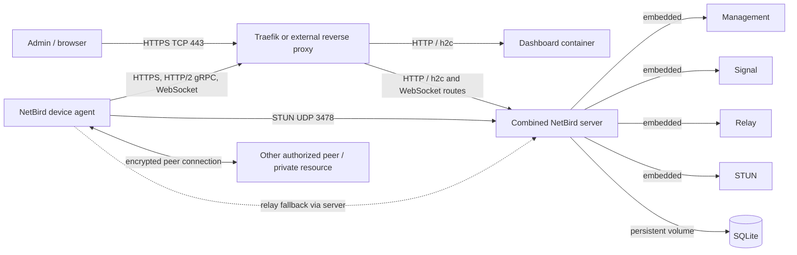

# ReyvanX Implementation Notes

This file is the running record of what has been inspected, decided, changed,
and verified for the tasks in [PROJECT_TASK_PLAN.md](./PROJECT_TASK_PLAN.md).
It records repository evidence separately from details that still need
confirmation from Lohit or from the live AWS deployment. Do not put credentials,
tokens, private endpoints, or other secrets here.

## Progress

| Task | Status | Notes |
|---|---|---|
| 1. Understand the code | Complete | Repository findings and open questions are below. |
| 2. Run it as-is | Complete with health caveat | Dashboard and Management status endpoints respond; combined-server `/health` reports HTTP 503 in the HTTP-only setup. See [RUNNING_LOCALLY.md](./RUNNING_LOCALLY.md). |
| 3. One Docker image per service | Not started | |
| 4. Docker Compose for the whole stack | Not started | |
| 5. Kubernetes manifests (local kind cluster) | Not started | |
| 6. Auto-scaling at 70% | Not started | |
| 7. Load test | Not started | |
| 8. Monitoring and alerts | Not started | |
| 9. Firewall / WAF stand-in | Not started | |
| 10. Replicated database and DR drill | Blocked | Needs Task 9 and Lohit's database, region, and RTO/RPO answers. |
| 11. Team demo | Blocked | Needs Task 10 and Lohit's hosting/cost approval. |
| 12. AWS ECR/EKS plan | Blocked | Needs prior tasks and explicit AWS-operation approval. |

## Task 1: Understand the code

### What the project is

ReyvanX is described by the repository README as a self-hosted secure networking
project based on the NetBird open-source codebase. It provides managed,
encrypted connectivity between enrolled devices and private resources. The
README describes the current AWS setup as development/initial validation on a
single EC2 server (2 vCPUs, 8 GB RAM, 100 GB disk), and explicitly says it is
not production-ready. These are repository claims, not independently verified
measurements of the live AWS deployment.

### Services and source locations

| Component | Source location | Role / deployment note |
|---|---|---|
| Client / agent | `client/` | Device-side CLI and networking agent; configures the endpoint and connects to Management, Signal, STUN, and Relay as required. |
| Management | `management/` | Control plane: identity, users, peers, network state, policy, and APIs. |
| Signal | `signal/` | Peer signaling and connection coordination. |
| Relay | `relay/` | Relays peer traffic when direct connectivity is unavailable. |
| STUN | `stun/` | Connectivity discovery and NAT traversal support. The current combined-server quickstart embeds STUN rather than starting a separate STUN container. |
| Combined server | `combined/` | Current quickstart's single server process combines Management, Signal, Relay, and STUN. |
| Dashboard | No dashboard source directory found | Quickstart uses the separately published `netbirdio/dashboard` container image. `client/ui/` is the desktop client UI; it is not the self-hosted web dashboard. |
| Reverse proxy | `proxy/` | Optional NetBird Proxy for publishing selected private services; distinct from the Traefik/Nginx ingress that fronts the installation. |
| Upload server | `upload-server/` | Auxiliary HTTP service that issues signed upload URLs and accepts uploads, using local storage or S3 configuration. It is not in the basic generated quickstart stack. |
| Identity provider support | `idp/`, `management/server/idp/` | Provider and embedded identity integration code; not a separately deployed service in the current quickstart. |

`dns/`, `route/`, `encryption/`, `flow/`, `shared/`, `agent-network/`, and
other top-level packages provide libraries or features; their presence does not
mean they are separate containers in the default quickstart.

### Project layout at a glance

The checkout is a Go monorepo: platform services and reusable networking
libraries are maintained together in one root Go module. A simplified map:

```text
ReyvanX/
├── client/                 Device agent, CLI, daemon, mobile and desktop clients
│   ├── cmd/                 CLI commands
│   ├── internal/            Agent networking and orchestration
│   ├── iface/, firewall/    Host networking integration
│   └── ui/, android/, ios/   Desktop and mobile clients
├── management/             Management/control plane and APIs
├── signal/                 Peer signaling service
├── relay/                  Relay service and health/metrics support
├── combined/               Combined Management + Signal + Relay + STUN binary
├── proxy/                  Optional identity-aware reverse proxy
├── upload-server/          Signed upload URL and upload service
├── idp/                    Embedded Dex and identity-provider support
├── shared/                 Cross-component management, signal, auth and metrics
├── dns/, route/, stun/     Networking packages
├── encryption/, flow/      Security and traffic/flow functionality
├── agent-network/          Agent Network functionality and documentation
├── infrastructure_files/  Self-hosting generators, Compose templates and config
├── docs/                   Repository documentation
├── integration_tests/, e2e/ Integration and end-to-end tests
├── release_files/, tools/  Packaging and developer utilities
├── go.mod, Makefile        Root Go module and common verification targets
└── deploy/                 ReyvanX deployment task plan and implementation notes
```

This map describes source-code organization. It is not a one-directory/one-
container mapping: for example, the default quickstart uses the `combined/`
binary for several core roles, while `management/`, `signal/`, and `relay/`
remain available as separate services. The dashboard image is maintained
outside this checkout.

### Opportunities to improve the project structure

These are recommendations, not changes already made. The existing source
layout is a coherent upstream-style monorepo; a wholesale directory
reorganization would make upstream updates, imports, generation, and Go
tooling harder without first showing a concrete benefit.

1. **Make the deployment source of truth obvious.** Clearly label the current
   combined-server quickstart and the older split-service templates, and link
   each to the exact generated files and supported use case. When Task 2
   verifies the intended path, keep its reproducible runbook under `deploy/`
   and explain when the legacy templates should or should not be used.
2. **Keep ReyvanX deployment assets together.** Continue putting new Compose,
   Kubernetes, load-test, monitoring, and DR assets in `deploy/` as planned.
   Keep upstream application packages in their existing locations unless a
   separately justified source change is needed.
3. **Pin versions for repeatable deployments.** Avoid floating `latest` image
   tags for validation or production; record compatible image versions or
   digests and the source commit they came from. This is especially important
   because the current quickstart defaults to published images and the source
   checkout itself reports `development`.
4. **Document configuration by deployment mode.** Provide clearly separated,
   secret-free examples for the combined quickstart and any supported
   split-service setup. State required versus optional variables, defaults,
   how secrets are generated/stored, and how to rotate/back up encryption keys.
   Do not copy live values into tracked files.
5. **Add preflight and generated-config checks.** Before bringing up containers,
   validate required domain/auth/storage values and ensure generated Compose
   and server configuration parse successfully. In CI, run shell lint/tests on
   the setup scripts and validate representative generated configurations
   without contacting AWS or creating cloud resources.
6. **Treat scale and state as architecture decisions.** The current quickstart
   persists SQLite-backed combined-server state on one Docker volume. Do not
   assume that adding replicas provides safe HA; choose and verify a supported
   shared database, backup/restore, session/state behavior, and migration plan
   before horizontal scaling or DR. Ask Lohit which database the live
   installation actually uses.
7. **Separate verification evidence from roadmap claims.** Record exact test
   commands and outcomes for each milestone, and label unverified AWS topology,
   IdP, ports, and database facts as unknown. The implementation-notes file
   already follows this pattern and can be extended as tasks are completed.
8. **Clarify Dashboard ownership and release compatibility.** The web Dashboard
   source is not in this repository, but its image is part of the stack.
   Document its upstream source/version, how a compatible image is selected,
   and who owns updates; do not invent a local Docker build for it.
9. **Maintain an upstream customization inventory.** Once Lohit identifies
   the upstream commit/tag, document ReyvanX-specific patches and whether
   changes are source modifications, deployment configuration, or branding.
   This will make future rebases and security updates safer.

The highest-value near-term improvements are repeatable local startup,
version-pinned images, safe configuration examples, generated-config checks,
and a verified database/backup decision. These map to the next planned tasks
and should be taken one at a time.

### Build and start workflows found

- The root [Makefile](../Makefile) provides lint and test targets, not a
  production stack start target or per-service image build targets.
- The repository has one Go module, `github.com/netbirdio/netbird`, at
  [go.mod](../go.mod). Go services can be built from source with commands such
  as `go build ./management`, `go build ./signal`, `go build ./relay`, and
  `go build ./combined`. These build commands do not configure or start a full
  deployment.
- Dockerfiles are present for Management, Signal, Relay, Combined, and the
  upload server. The self-hosted web Dashboard has no source directory or
  Dockerfile in this checkout; the quickstart pulls its published image.
- The documented self-hosting path in the repository is
  [infrastructure_files/getting-started.sh](../infrastructure_files/getting-started.sh).
  It generates a `docker-compose.yml`, `config.yaml`, and `dashboard.env` in
  the directory where it is run, then starts the containers. By default it
  uses Traefik, obtains TLS certificates through Let's Encrypt, starts the
  dashboard image and combined NetBird server image, and uses the embedded
  identity provider. The domain and ACME email must be supplied interactively
  or through the supported environment variables. A working Docker Engine,
  Docker Compose, `jq`, and a resolvable public domain are needed for the
  default public/TLS setup.
- The current script's default images are
  `netbirdio/dashboard:latest` and `netbirdio/netbird-server:latest`. It does
  not build those images from this checkout.
- The older
  [docker-compose.yml.tmpl](../infrastructure_files/docker-compose.yml.tmpl)
  and [configure.sh](../infrastructure_files/configure.sh) describe a
  multi-container setup with separate Dashboard, Signal, Relay, Management,
  and Coturn services. Treat those templates as an alternate/legacy setup,
  not as the default generated by the current quickstart.
- Other scripts under `infrastructure_files/` include an enterprise setup and
  migration helpers. The retired `getting-started-with-dex.sh` directs users
  to the current quickstart, which now embeds Dex.
- The README does not contain evidence of the exact Compose/config currently
  deployed on the AWS EC2 host. No services were started during Task 1.

### NetBird version and ReyvanX customizations

- The source identifies itself as module
  `github.com/netbirdio/netbird`; [version/version.go](../version/version.go)
  reports `development` for non-release builds.
- This checkout has no Git tags, so it does not identify a NetBird release
  version. Its current commit/revision and Go toolchain declaration are not a
  substitute for the upstream release version.
- The Compose generator defaults to the floating `latest` images. The exact
  image digests or versions currently running on AWS are not recorded here.
- The local Git history shows that after the initial ReyvanX source import the
  only later tracked change is `README.md`. This establishes the visible
  post-import change, but the initial imported source was not compared against
  a pinned upstream commit. Therefore the source-level ReyvanX customizations
  relative to NetBird upstream, and any AWS-only configuration changes, cannot
  be reliably enumerated yet.
- Repository-specific documentation presents ReyvanX branding, its AWS
  development/validation context, and a future EKS/HA/DR roadmap. The source
  also contains NetBird features such as Agent Network, but their presence
  alone does not establish that ReyvanX customized or enabled them.

### Database

- The current generated quickstart config selects SQLite and stores server data
  in `/var/lib/netbird`; Compose mounts the persistent `netbird_data` volume
  there. The generated `config.yaml` also includes a data-store encryption
  key.
- The older Management config supports SQLite by default and contains
  configuration paths for PostgreSQL and MySQL DSNs.
- The enterprise setup script contains PostgreSQL setup/configuration. Its
  presence does not prove PostgreSQL is being used in ReyvanX's live instance.
- The database type, data directory/volume, backup method, and whether the
  live AWS instance is using the default SQLite config remain unconfirmed.

### Ports and protocols

Ports depend on the selected deployment mode. Do not copy the legacy
multi-container port list into a Kubernetes or AWS firewall rule without
confirming the actual config.

| Service / endpoint | Current quickstart default | Older split-container or standalone notes |
|---|---|---|
| Public reverse proxy / dashboard | TCP 80 (redirect) and TCP 443 (HTTPS); dashboard is served behind Traefik. | Dashboard container serves TCP 80, with optional TCP 443 in the old TLS setup. |
| Combined server | Internal TCP 80; management HTTP/API, gRPC, signaling, relay/WebSocket routes go through the reverse proxy. Health check TCP 9000 and metrics TCP 9090 are configured internally and are not published by the default Compose template. | Not applicable as one process to the older split setup. |
| Management | Routed through public TCP 443 to combined server. | Standalone default TCP 33073; management metrics default TCP 9090. The old template routes Management API/gRPC to the Management container. |
| Signal | Routed through public TCP 443 to combined server, including gRPC and WebSocket routes. | Standalone gRPC default TCP 10000 and metrics TCP 9090. Old Compose maps a configurable host port (default 10000) to container TCP 80. |
| Relay | Routed through public TCP 443 to combined server in the current quickstart. | Old template uses TCP 33080. Standalone Relay's flag default is TCP 443; actual exposed/listen port is configuration-dependent. |
| STUN | UDP 3478 is published by the generated Compose file. | Old Coturn template listens on TCP/UDP 3478 and TLS TCP/UDP 5349; its default TURN relay range is UDP 49152–65535. The old config also contains TURN credentials and a public-IP setting. |
| Optional NetBird Proxy | If enabled, Compose publishes UDP 51820; its internal TLS listener is TCP 8443 and is routed through Traefik TCP passthrough. | Optional feature; not part of the base core stack. |
| Upload server | Not part of the basic quickstart stack. | Standalone default HTTP listener is TCP 8080; configurable with `SERVER_ADDRESS`. |
| External proxy, if used | Not applicable to built-in Traefik. | Generated setup defaults to localhost-bound TCP 8080 for dashboard and TCP 8081 for combined server, plus UDP 3478 for STUN; the external proxy must be configured separately. |

The agent also makes outbound requests to the configured control and
connectivity endpoints and establishes peer traffic according to network
configuration. The exact AWS security-group rules and ports for the live
deployment cannot be determined from this checkout alone.

### Configuration and environment

There is no checked-in runtime `.env` for the live ReyvanX AWS instance.
Configuration is generated in the quickstart working directory.

For the current quickstart:

- `NETBIRD_DOMAIN` is required (or entered interactively); `use-ip` selects an
  HTTP/IP setup rather than normal public-domain TLS.
- With built-in Traefik, `NETBIRD_LETSENCRYPT_EMAIL` is required (or prompted
  for) for certificate registration.
- `NETBIRD_AGENT_NETWORK=true` enables a specialized preset and has its own
  behavior; it is not the normal default.
- Optional reverse proxy, NetBird Proxy, CrowdSec, localhost binding, and
  trusted proxy settings control which generated services, routes, and ports
  are used.
- The script generates random relay-auth, store-encryption, and session-cookie
  encryption values. These are secrets and must not be copied into this notes
  file or committed.
- `config.yaml` describes the combined server (listen/exposed addresses,
  STUN, metrics, health check, authentication, data directory, SQLite store,
  encryption key, and trusted reverse proxy). `dashboard.env` contains the
  dashboard endpoints and embedded-IdP client settings.

For the older split setup, `setup.env.example` documents domain/image tags,
external OIDC discovery endpoint, client ID, audience and scopes, optional
client secrets, device-flow/PKCE settings, management-side IdP credentials,
TURN domain/public IP, service ports, and storage selection. Optional
PostgreSQL/MySQL DSNs are passed into Management. Which of these values apply
to the live AWS deployment is not known.

### Login / OIDC / IdP

- The current quickstart uses the Management server's embedded Dex-based
  identity provider at `/oauth2`; the generated dashboard config sets issuer
  and client settings to that server. Users complete onboarding through the
  dashboard.
- The management source includes embedded/local IdP and external provider
  integrations. The repository's older setup also accepts an external OIDC
  discovery endpoint and provider-specific configuration. Management-side
  IdP administration credentials are separate from the dashboard's user
  login configuration.
- The project README does not name the IdP used in the actual AWS instance.
  No active OIDC values or secret-bearing runtime config were inspected.

### Service communication

This diagram reflects the current quickstart, not a verified live AWS topology:



### Questions for Lohit

1. What NetBird upstream release or commit was the initial source import based
   on, and which source-level changes/features were made specifically for
   ReyvanX?
2. Which image tags/digests and exact Compose/config files are currently running
   on the AWS EC2 instance? Is the live stack the combined-server quickstart
   or the older separate-service deployment?
3. Which database is the live instance using (SQLite, PostgreSQL, MySQL, or
   another system), where is its data stored, and how are backups/restores
   performed?
4. Which domain and public listener ports are used today? What are the AWS
   security-group rules for TCP, UDP, TURN relay ports, and peer connectivity?
5. Which IdP is used for dashboard/user login, and which values are configured
   in the dashboard and Management? Please provide configuration guidance, not
   passwords, client secrets, or tokens.
6. Is the embedded Dex login enabled for the current environment, or is an
   external OIDC provider configured? Are Management's provider-admin
   credentials configured separately?
7. Is the optional NetBird Proxy, CrowdSec, TURN/Coturn, or Agent Network
   enabled in the live deployment?
8. Where are the live deployment's sanitized Compose/config files and
   operational runbooks maintained, and who owns changes to them?
9. Which AWS region should be primary and which should be used for DR?
10. What RTO and RPO are required, and what AWS spending limit applies to
    development, tests, and demos?
11. What AWS IAM Identity Center SSO start URL and SSO region should be used
    for the `reyvanx` CLI profile? (The console sign-in URL alone is not
    enough to infer those CLI settings.)
12. Which public demo option is preferred (secure laptop tunnel or Mumbai
    `t3.medium` EC2), what is the budget, and is there explicit approval to
    push images to ECR? EKS creation needs separate explicit approval.

## Task 1 record

- **Changed:** Added this repository findings and implementation-notes file,
  including the project-layout overview and improvement opportunities.
- **Source-code changes:** None.
- **AWS changes:** None.
- **Run instructions:** No services were started for this read-only inspection.
- **Verification:** Findings were checked against the README, Go module/version
  files, root Makefile, current and legacy Compose generators, configuration
  templates, and service flags/defaults.
- **Open dependency:** Lohit's answers above are needed to establish the live
  deployment's actual image versions, configuration, database, identity
  provider, ports, and future DR constraints.

## Task 2: Run it as-is

- **Changed:** Added [RUNNING_LOCALLY.md](./RUNNING_LOCALLY.md) with the
  reproducible local quickstart, the localhost-only Caddy proxy and Compose
  override, checks, stop commands, and observed results. Added
  [`deploy/local/Caddyfile`](./local/Caddyfile) and
  [`deploy/local/docker-compose.override.yml`](./local/docker-compose.override.yml)
  to make the quickstart's manual-proxy mode usable from localhost without
  exposing the development ports to the LAN.
- **Runtime:** Docker Desktop 4.94.0, Docker CLI 29.8.2, Docker Compose 5.5.1.
  The quickstart pulled `netbirdio/dashboard:latest` and
  `netbirdio/netbird-server:latest`; the Management startup log reported
  version `0.80.0`. Caddy is running from `caddy:2-alpine`. All published
  ports in the final Compose configuration are loopback-bound.
- **Dashboard:** Opened `http://127.0.0.1/` in the browser. It displays the
  “Welcome to NetBird” first-administrator setup form at `/setup`.
- **Endpoint checks:** `GET /` returned HTTP 200; `GET /api/instance` returned
  HTTP 200 and `setup_required: true`; OIDC discovery returned HTTP 200 with
  issuer `http://127.0.0.1/oauth2`; Prometheus metrics returned HTTP 200.
- **Health caveat:** `GET /health` returned HTTP 503 with `status: unhealthy`,
  `listeners: null`, and `certificate_valid: false`. The combined-server log
  says Relay WebSocket is multiplexed on the Management port with no separate
  Relay listener. The existing health checker reports that HTTP-only mode as
  unhealthy. This is recorded, not fixed with a Go business-logic change.
- **Application changes / AWS resources:** No Go business logic changed and
  no AWS resources were created. Generated deployment config and the SQLite
  volume are kept outside the repository in `~/reyvanx-local-task2/`.
- **Status:** Complete for the documented Task 2 criterion that the Dashboard
  opens and service status endpoints respond, with the unhealthy `/health`
  response explicitly disclosed above.

## Future task records

For each later task, add a dated entry with:

- Outcome and files changed.
- Commands or steps to run it.
- Exact verification commands and results.
- Decisions, constraints, or open questions.
- Whether external resources were created and what approval covered them.
